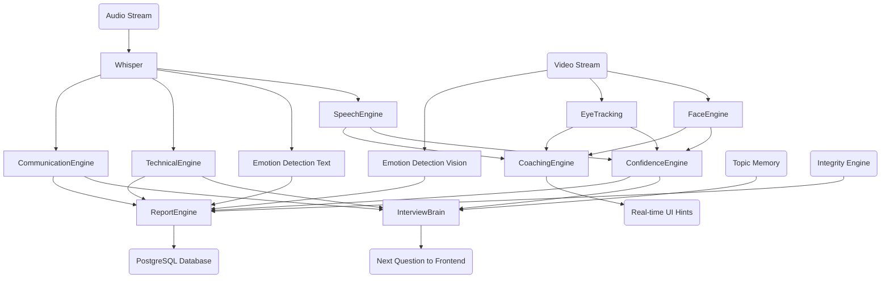

# Deep AI Implementation Audit

This audit evaluates the intelligence layers of the application, completely stripping away the UI, authentication, and deployment layers to focus purely on the machine learning models and heuristics running in the backend.

---

## Engine Breakdown

### 1. Interview Brain (Orchestrator)
**1. Actually implemented?** Yes.
**2. Real AI model?** Uses LLMs via LiteLLM wrapper.
**3. Which model?** Defaults to `gpt-4o` (or `gemini-1.5-pro` / `claude-3-5-sonnet` if API keys are provided).
**4. Which library?** `litellm`.
**5. Pretrained weights?** Hosted models via API.
**6. Does inference happen?** Yes, via API calls.
**7. Real-time?** No, synchronous waiting on API.
**8. Production ready?** Yes, via LiteLLM fallback mechanisms.
**9. CPU or GPU?** Cloud APIs (N/A local).
**10. Sync/Async?** Asynchronous (`await llm.generate_json`).
* **Input:** Job Role, previous question, previous answer transcript, missing technical points, difficulty modifier.
* **Processing:** Injects topic memory to avoid repetition, adjusts difficulty via system prompt instructions, wraps in JSON schema.
* **Model:** GPT-4o / Gemini 1.5 Pro.
* **Output:** Next Question, Topic, Subtopic, Difficulty.
* **Stored:** In-memory context passed to WebSocket, eventually PostgreSQL `responses` table.
* **Consumed by:** Frontend `<LivePracticePreview>` to read aloud the next question.
* **Readiness Score:** 85/100

### 2. Speech Engine
**1. Actually implemented?** Yes.
**2. Real AI model?** No, this is an acoustic heuristics aggregator.
**3. Which model?** N/A (wraps Whisper + RegExp).
**4. Which library?** Standard Python `re`.
**5. Pretrained weights?** N/A.
**6. Does inference happen?** No, heuristic math.
**7. Real-time?** Near real-time (after audio chunk finishes).
**8. Production ready?** Basic heuristics. Needs NLP for filler words rather than RegEx.
**9. CPU or GPU?** CPU.
**10. Sync/Async?** Synchronous math.
* **Input:** Audio transcription string, duration seconds.
* **Processing:** Counts words, divides by minutes for WPM. Uses RegEx word boundaries to count hardcoded filler words ("um", "like", "basically").
* **Model:** N/A.
* **Output:** `wpm`, `filler_count`, `pace_label`, `fluency_score` (100 - penalties).
* **Stored:** Temporary dictionary.
* **Consumed by:** `InterviewBrain` and `ConfidenceEngine`.
* **Readiness Score:** 60/100

### 3. Whisper (Transcription)
**1. Actually implemented?** Yes.
**2. Real AI model?** Yes.
**3. Which model?** Whisper Base.
**4. Which library?** `faster-whisper`.
**5. Pretrained weights?** OpenAI `base` model.
**6. Does inference happen?** Yes.
**7. Real-time?** Yes (chunked).
**8. Production ready?** Yes, CTranslate2 is highly optimized.
**9. CPU or GPU?** CPU (`compute_type="int8"`).
**10. Sync/Async?** Synchronous (blocking).
* **Input:** Binary audio file path (`.webm` / `.wav`).
* **Processing:** CTranslate2 quantization (`int8`). Beam search (`beam_size=5`).
* **Model:** `faster-whisper` (Base).
* **Output:** Transcription text, Language, Duration.
* **Stored:** PostgreSQL (`responses` table transcript).
* **Consumed by:** Speech Engine, LLM evaluators.
* **Readiness Score:** 90/100

### 4. Technical Engine
**1. Actually implemented?** Yes.
**2. Real AI model?** Uses LLMs via LiteLLM wrapper.
**3. Which model?** GPT-4o / Gemini 1.5 Pro.
**4. Which library?** `litellm`.
**5. Pretrained weights?** Hosted models.
**6. Does inference happen?** Yes.
**7. Real-time?** No, runs after an answer is completed.
**8. Production ready?** Conceptually yes, practically no (cannot execute code).
**9. CPU or GPU?** Cloud APIs.
**10. Sync/Async?** Asynchronous (`await`).
* **Input:** Question string, Candidate Answer string, Job Role string.
* **Processing:** System prompt instructs it to ignore communication skills and focus strictly on technical depth. Forces JSON schema.
* **Model:** GPT-4o / Gemini 1.5 Pro.
* **Output:** `technical_score` (0-100), `strengths`, `weaknesses`, `missing_technical_points`.
* **Stored:** PostgreSQL (`responses` table JSONB `detailed_feedback`).
* **Consumed by:** InterviewBrain (to generate adaptive follow-ups) and ReportEngine.
* **Readiness Score:** 75/100

### 5. Communication Engine
**1. Actually implemented?** Yes.
**2. Real AI model?** Uses LLMs via LiteLLM wrapper.
**3. Which model?** GPT-4o / Gemini 1.5 Pro.
**4. Which library?** `litellm`.
**5. Pretrained weights?** Hosted models.
**6. Does inference happen?** Yes.
**7. Real-time?** No, runs post-answer.
**8. Production ready?** Yes.
**9. CPU or GPU?** Cloud APIs.
**10. Sync/Async?** Asynchronous (`await`).
* **Input:** Candidate Answer Transcript string.
* **Processing:** Evaluates clarity, structure (STAR framework detection), and tone.
* **Model:** GPT-4o / Gemini 1.5 Pro.
* **Output:** `communication_score` (0-100), `structure_used`.
* **Stored:** PostgreSQL (`responses` table).
* **Consumed by:** InterviewBrain, ReportEngine.
* **Readiness Score:** 80/100

### 6. Face Engine
**1. Actually implemented?** Yes.
**2. Real AI model?** Yes.
**3. Which model?** MediaPipe Face Mesh.
**4. Which library?** `mediapipe`, `cv2`.
**5. Pretrained weights?** MediaPipe built-in `face_mesh` TFLite models.
**6. Does inference happen?** Yes.
**7. Real-time?** Yes (frame-by-frame).
**8. Production ready?** Yes.
**9. CPU or GPU?** CPU.
**10. Sync/Async?** Synchronous processing.
* **Input:** RGB Video Frame (`numpy.ndarray`).
* **Processing:** Solves PnP (Perspective-n-Point) on 3D face mesh coordinates to determine pitch, yaw, and roll in degrees. Calculates standard deviations.
* **Model:** `mediapipe.solutions.face_mesh`.
* **Output:** `face_count`, `engagement_score` (penalty for looking away), `head_stability_score` (inversely proportional to standard deviation of yaw/pitch).
* **Stored:** Aggregated in memory.
* **Consumed by:** ConfidenceEngine.
* **Readiness Score:** 85/100

### 7. Eye Tracking
**1. Actually implemented?** Yes.
**2. Real AI model?** Yes.
**3. Which model?** MediaPipe Face Mesh (with Iris Refinement).
**4. Which library?** `mediapipe`.
**5. Pretrained weights?** MediaPipe `refine_landmarks=True` (Iris).
**6. Does inference happen?** Yes.
**7. Real-time?** Yes.
**8. Production ready?** Yes, highly accurate.
**9. CPU or GPU?** CPU.
**10. Sync/Async?** Synchronous processing.
* **Input:** RGB Video Frame.
* **Processing:** Measures distance of iris center (landmark 468) relative to eye corners (landmarks 33 and 133). Calculates ratio.
* **Model:** `mediapipe.solutions.face_mesh`.
* **Output:** `is_looking_at_camera` (Boolean), `eye_contact_percent`.
* **Stored:** In-memory running tallies.
* **Consumed by:** CoachingEngine, ConfidenceEngine.
* **Readiness Score:** 90/100

### 8. Emotion Detection
**1. Actually implemented?** Yes.
**2. Real AI model?** Yes (Two separate models: Vision and Text).
**3. Which model?** MTCNN + CNN (Vision) AND DistilRoBERTa (Text).
**4. Which library?** `fer` (Vision) and HuggingFace `transformers` (Text).
**5. Pretrained weights?** `j-hartmann/emotion-english-distilroberta-base`.
**6. Does inference happen?** Yes.
**7. Real-time?** Yes (Vision) / Post-chunk (Text).
**8. Production ready?** Vision: No (FER is heavy on CPU). Text: Yes.
**9. CPU or GPU?** CPU (TensorFlow explicitly pinned to CPU).
**10. Sync/Async?** Synchronous (Blocking).
* **Input:** Video Frames / Text Chunks.
* **Processing:** CNN classifies face pixels into 7 emotion buckets. RoBERTa tokenizes text and classifies into 7 emotion buckets.
* **Model:** MTCNN (Face detection) -> TensorFlow Keras CNN (Emotions) // DistilRoBERTa.
* **Output:** Emotion dictionaries (e.g., `{"happy": 0.8, "sad": 0.1}`).
* **Stored:** PostgreSQL (timeline data).
* **Consumed by:** ReportEngine (for timeline graphs).
* **Readiness Score:** Vision: 50/100 (Too slow for Python event loop without GPU), Text: 85/100.

### 9. Confidence Engine
**1. Actually implemented?** Yes.
**2. Real AI model?** No, deterministic heuristic fusion.
**3. Which model?** N/A.
**4. Which library?** N/A.
**5. Pretrained weights?** N/A.
**6. Does inference happen?** No.
**7. Real-time?** Yes.
**8. Production ready?** Too simplistic.
**9. CPU or GPU?** CPU.
**10. Sync/Async?** Synchronous math.
* **Input:** `fluency_score`, `eye_contact_percent`, `head_stability_score`, `facial_engagement_score`.
* **Processing:** Multiplies metrics by hardcoded weights (35%, 35%, 15%, 15%).
* **Model:** Heuristic formula.
* **Output:** `confidence_score` (0-100), `difficulty_modifier_delta` (-1, 0, +1).
* **Stored:** PostgreSQL.
* **Consumed by:** InterviewBrain (to adapt difficulty of next question).
* **Readiness Score:** 40/100

### 10. Coaching Engine
**1. Actually implemented?** Yes.
**2. Real AI model?** No, heuristic threshold triggers.
**3. Which model?** N/A.
**4. Which library?** N/A.
**5. Pretrained weights?** N/A.
**6. Does inference happen?** No.
**7. Real-time?** Yes.
**8. Production ready?** Yes, handles cooldowns well.
**9. CPU or GPU?** CPU.
**10. Sync/Async?** Synchronous threshold checks.
* **Input:** Real-time stream metrics (`wpm`, `eye_contact`, `face_count`).
* **Processing:** Checks values against hardcoded thresholds (e.g., WPM > 180 = Fast). Uses a dictionary `_last_triggered` to enforce 15-second cooldowns to prevent UI spam.
* **Model:** `if-else` thresholds.
* **Output:** JSON objects containing `CoachingSeverity` and `message`.
* **Stored:** Not permanently stored. Emitted directly to WebSocket.
* **Consumed by:** Frontend WebSocket listener (React Toast notifications).
* **Readiness Score:** 80/100

### 11. Integrity Engine
**1. Actually implemented?** Yes.
**2. Real AI model?** No, penalty-based arithmetic.
**3. Which model?** N/A.
**4. Which library?** N/A.
**5. Pretrained weights?** N/A.
**6. Does inference happen?** No.
**7. Real-time?** Post-session aggregation.
**8. Production ready?** Very basic. Lacks audio-based multiple voice detection.
**9. CPU or GPU?** CPU.
**10. Sync/Async?** Synchronous.
* **Input:** List of `IntegrityEvent` records (tab switches, multiple faces).
* **Processing:** Starts at 100, subtracts weighted points (-15 for multiple faces, -2 for tab switches).
* **Model:** Arithmetic deductions.
* **Output:** Final Integrity Score (0-100) and event frequency summary.
* **Stored:** PostgreSQL (Report table).
* **Consumed by:** ReportEngine.
* **Readiness Score:** 50/100

### 12. Report Engine
**1. Actually implemented?** Yes.
**2. Real AI model?** Uses LLM.
**3. Which model?** GPT-4o / Gemini 1.5 Pro.
**4. Which library?** `litellm`.
**5. Pretrained weights?** Hosted models.
**6. Does inference happen?** Yes.
**7. Real-time?** No, async background task.
**8. Production ready?** Yes, runs in Celery.
**9. CPU or GPU?** Cloud APIs.
**10. Sync/Async?** Asynchronous.
* **Input:** All collected session data, radar data, question breakdown, integrity scores.
* **Processing:** Sends the aggregated JSON payload to the LLM and asks for a structured executive summary and learning roadmap. Calculates the headline Readiness Score.
* **Model:** GPT-4o / Gemini 1.5 Pro.
* **Output:** Complete JSON Report payload (Candidate + Recruiter variations).
* **Stored:** PostgreSQL (`reports` table).
* **Consumed by:** Candidate Dashboard, Recruiter Dashboard.
* **Readiness Score:** 90/100

---

## Engine Dependency & Data Flow Graph

