# Holistic Interview Intelligence - Complete Architecture Reference

This document serves as the master blueprint of the Holistic Interview Intelligence platform, detailing the structural, infrastructural, and behavioral architectures of the system.

---

## 1. Folder Architecture

The project follows a monorepo structure separating the frontend, backend, and infrastructure definitions.

```text
Holistic-Interview-Intelligence/
├── backend/
│   ├── app/
│   │   ├── api/v1/         # REST and WebSocket route definitions
│   │   ├── core/           # Config, Security, Celery, and DB session logic
│   │   ├── models/         # SQLAlchemy ORM definitions
│   │   ├── schemas/        # Pydantic validation schemas
│   │   ├── services/       # Core Business Logic & AI Engines
│   │   └── tasks/          # Celery asynchronous background tasks
│   ├── tests/              # (Empty/Placeholder)
│   ├── requirements.txt    # Python dependencies
│   └── Dockerfile          # Backend and Worker container image definition
├── frontend/
│   ├── public/             # Static assets
│   ├── src/
│   │   ├── components/     # Reusable React components (UI/Interactive)
│   │   ├── hooks/          # Custom React hooks (useSpeechAnalysis)
│   │   ├── lib/            # Utilities (axios setup, tailwind merge)
│   │   ├── pages/          # Astro pages (Routing boundary)
│   │   └── store/          # Zustand global state management
│   ├── astro.config.*      # Astro build configurations
│   ├── tailwind.config.js  # Styling tokens
│   ├── package.json        # Node dependencies
│   └── Dockerfile          # Frontend container image definition
├── infrastructure/
│   ├── docker-compose.yml       # Local development stack
│   └── docker-compose.prod.yml  # Production deployment stack
├── scripts/                # CI/CD and load testing scripts
└── Makefile                # Developer workflow commands
```

---

## 2. Service Architecture

The system is a distributed micro-monolith:
1.  **Frontend Service (Astro + React):** Handles client-side rendering, WebRTC device capture, and WebSocket transmission.
2.  **API Gateway / Backend (FastAPI):** Handles REST routing, database CRUD, and active WebSocket streams. Integrates directly with synchronous ML models.
3.  **Task Worker (Celery):** Processes heavy background tasks (LLM report generation, async email sending).
4.  **Task Scheduler (Celery Beat):** Handles cron-based periodic cleanup tasks.
5.  **Database (PostgreSQL):** Primary persistent store.
6.  **Message Broker (Redis):** Handles Celery task queuing and Pub/Sub.

---

## 3. Database ER Diagram

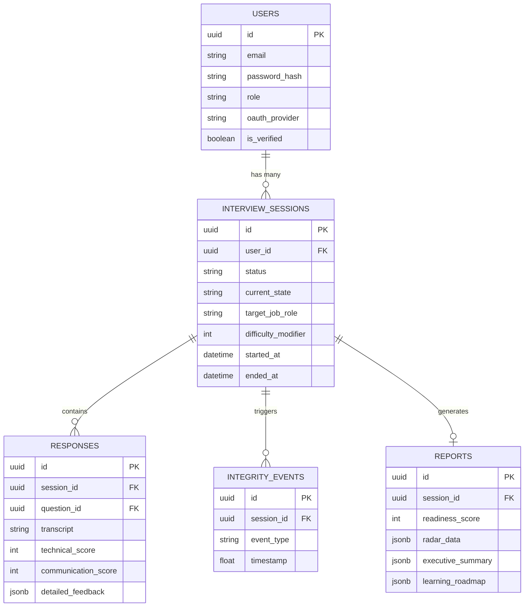

---

## 4. API Architecture
*   **Protocol:** HTTP/1.1 (REST) and HTTP/1.1 Upgrade (WebSockets).
*   **Framework:** FastAPI (Python).
*   **Documentation:** OpenAPI (Swagger UI) auto-generated at `/docs`.
*   **Authentication:** JWT Bearer tokens passed via `Authorization` header.

## 5. WebSocket Architecture
*   **Endpoints:** `/ws/speech/{session_id}` and `/ws/behavioral/{session_id}`.
*   **Data Flow:** Binary chunk streams (WebM for audio, base64 JPEGs for video).
*   **Event Loop:** Starlette handles connections asynchronously. Frames are pushed to a `deque` buffer and processed in a synchronous executor pool to prevent blocking the async loop.

## 6. Celery Architecture
*   **Broker:** Redis (Port 6379, DB 0).
*   **Result Backend:** Redis.
*   **Workers:** Dedicated Docker container running `celery -A app.core.celery_app worker`.
*   **Tasks:** `generate_post_interview_report`, `generate_dynamic_question`.

## 7. Redis Architecture
*   Currently used exclusively as the message queue for Celery.
*   *Limitation:* Not currently utilized for Application caching or cross-node WebSocket pub/sub (which prevents horizontal scaling of the FastAPI backend).

## 8. LLM Architecture
*   **Wrapper:** LiteLLM.
*   **Providers:** OpenAI (`gpt-4o`), Google (`gemini-1.5-pro`), Anthropic (`claude-3-5-sonnet`).
*   **Usage:** Semantic JSON generation for technical evaluation, communication evaluation, dynamic question creation, and final executive summaries.

## 9. Deployment & 10. Docker Architecture
*   **Containerization:** Multi-stage Dockerfiles for minimal image sizes.
*   **Orchestration:** Docker Compose (`infrastructure/docker-compose.yml`).
*   **Network:** Shared internal Docker network. Ports exposed only for Frontend (4321) and Backend API (8000). Databases are hidden from host network.

## 11. Kubernetes Architecture
*   *Missing:* Currently, there are no Helm charts or Kubernetes YAML manifests (`Deployment`, `Service`, `Ingress`) present in the repository.

## 12. CI/CD Architecture
*   **CI:** GitHub Actions (`.github/workflows/ci.yml`). Triggers on Pull Requests. Runs Ruff linting and PyTest (though tests are currently missing).
*   **CD:** `cd.yml` placeholder. Does not currently push images to a registry or trigger cloud deployments.

---

## Sequence Diagrams

### 1. Login
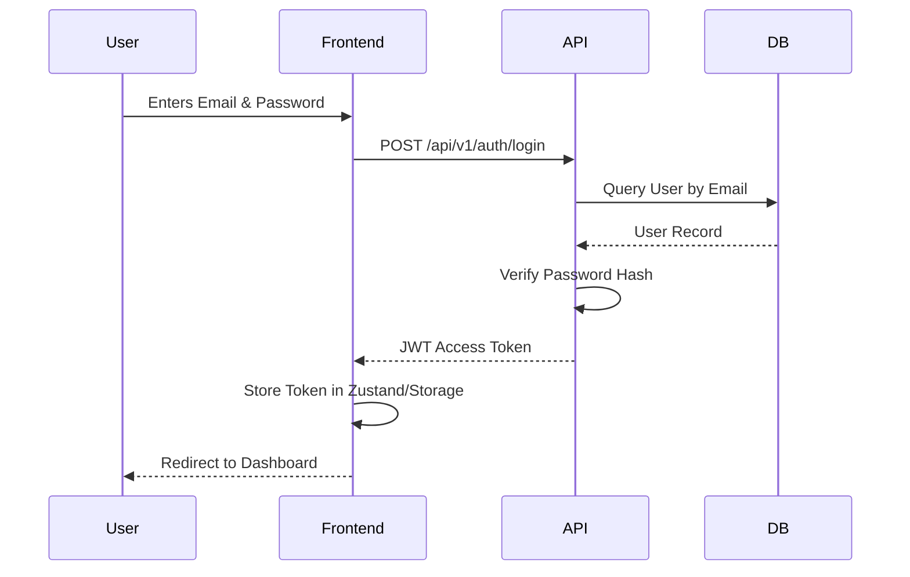

### 2. Interview Start
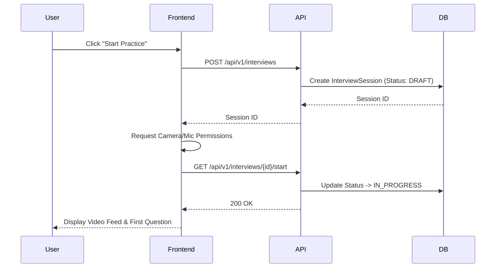

### 3. Audio Processing
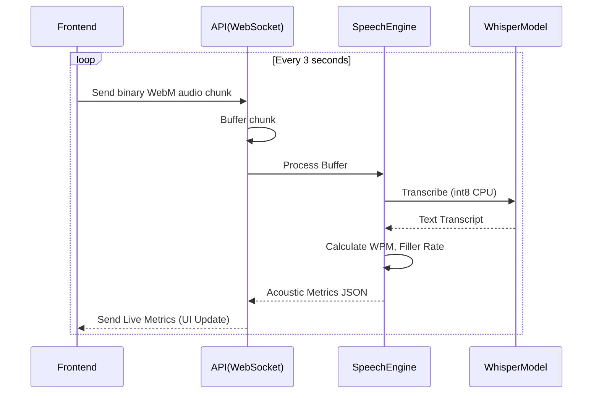

### 4. Video Processing
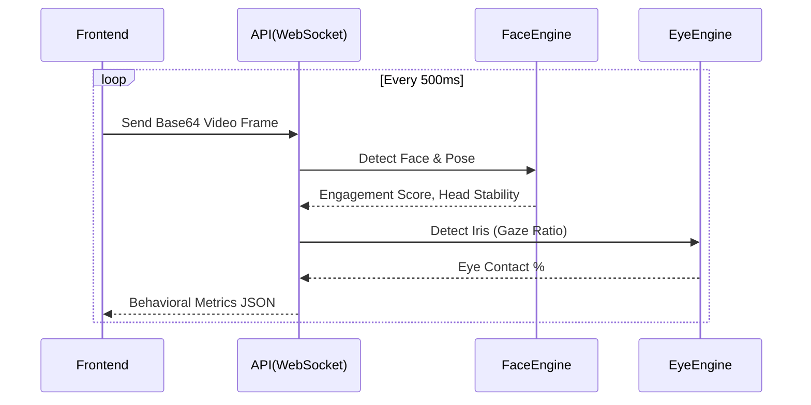

### 5. Question Generation
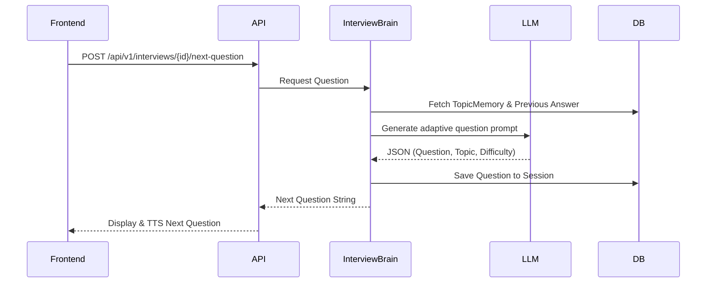

### 6. Answer Evaluation
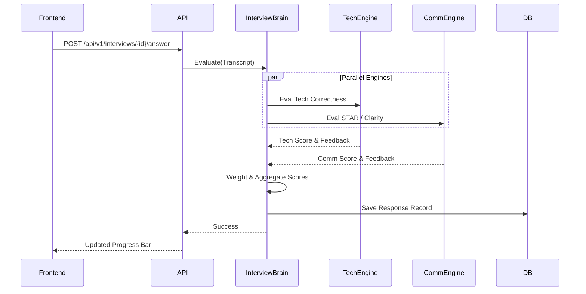

### 7. Report Generation
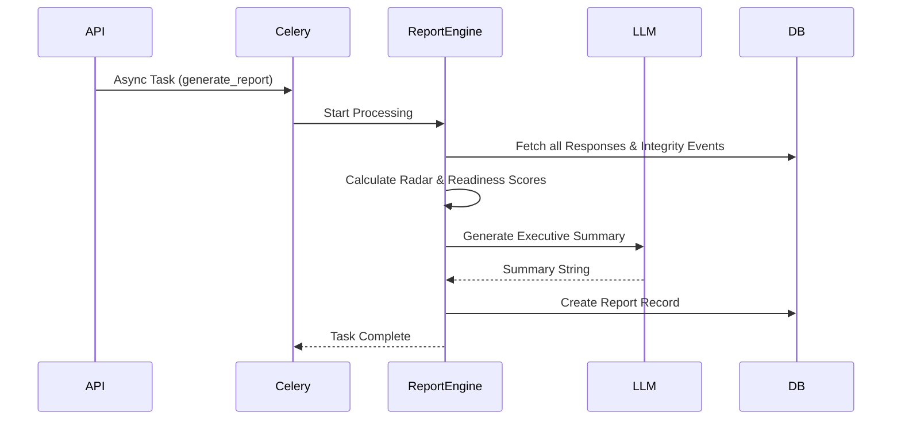

### 8. Dashboard Loading
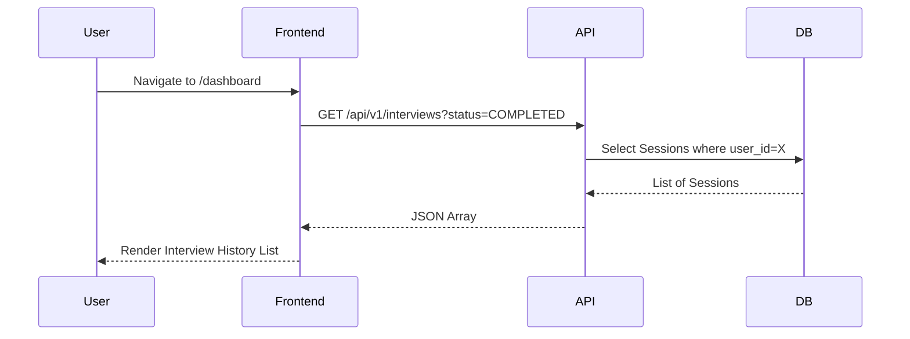

### 9. Playback
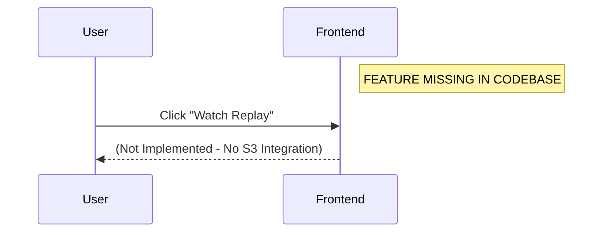

### 10. Recruiter Review
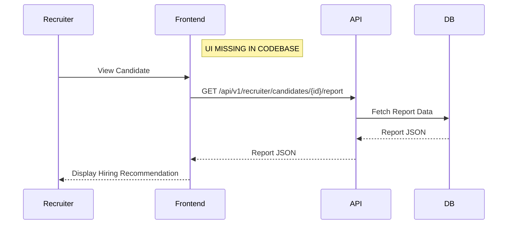

---

## Complete System Dependency Graph

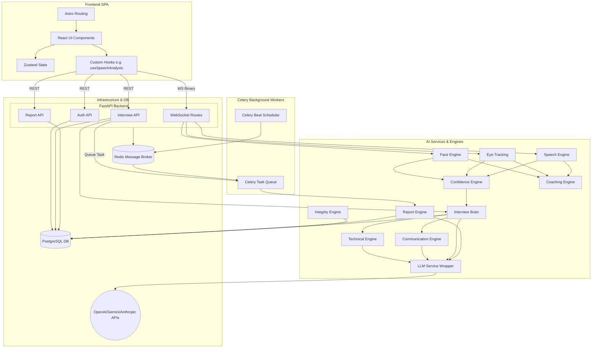
