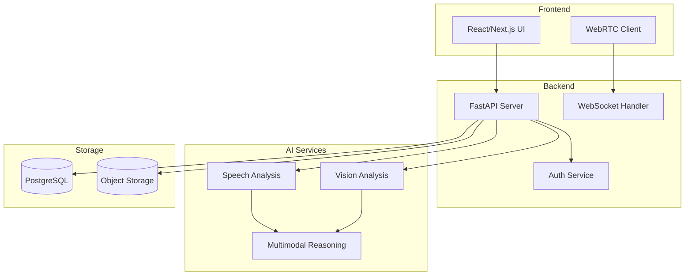

# System Architecture

## Overview
Holistic Interview Intelligence is a comprehensive interview preparation and analysis platform.

## High-Level Architecture

## Components

### Frontend
- React-based SPA with SSR support
- WebRTC for real-time video/audio streaming
- Zustand for state management

### Backend
- FastAPI for REST API
- WebSocket for real-time communication
- JWT-based authentication

### AI Services
- Speech analysis using Whisper
- Vision analysis for facial expressions
- Multimodal fusion for comprehensive assessment

### Storage
- PostgreSQL for structured data
- Object storage for media files
