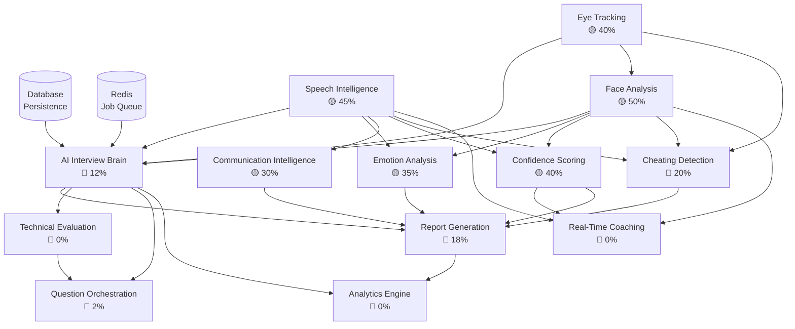

# AI Interview System — Deep Architectural Gap Analysis

> **Scope**: AI Interview Brain & all sub-engines only.  
> Authentication, UI pages, resource pages, profile pages, and infrastructure are excluded.  
> Analysis date: 2026-06-24

---

## Executive Summary

| Engine | Status | Production Readiness | Complexity |
|---|---|---|---|
| AI Interview Brain | Skeleton | 12% | 🔴 Very High |
| Question Orchestration Engine | Missing | 2% | 🔴 Very High |
| Speech Intelligence Engine | Partial | 45% | 🟡 High |
| Technical Evaluation Engine | Missing | 0% | 🔴 Very High |
| Communication Intelligence Engine | Partial | 30% | 🟡 High |
| Real-Time Coaching Engine | Missing | 0% | 🔴 Very High |
| Face Analysis Engine | Partial | 50% | 🟡 High |
| Eye Tracking Engine | Partial | 40% | 🟡 High |
| Confidence Scoring Engine | Partial | 40% | 🟡 Medium |
| Emotion Analysis Engine | Partial | 35% | 🟡 Medium |
| Cheating Detection Engine | Skeleton | 20% | 🔴 Very High |
| Report Generation Engine | Skeleton | 18% | 🟡 High |
| Analytics Engine | Missing | 0% | 🔴 Very High |

---

## Module 1 — AI Interview Brain

### 1.1 Current Implementation Status
The "brain" does not exist as a unified orchestrator. Its responsibilities are scattered: `analysis.py` (backend API v1) acts as a dummy job dispatcher using in-memory `Dict` storage with `asyncio.sleep()` simulations instead of real AI calls. The `multimodal-reasoning/` layer has a real `MultimodalFusion`, `LLMReasoner`, and `TimelineBuilder`, but **none are connected to any live endpoint**. The `LLMReasoner` is wired to call OpenAI/Gemini but has no API key management or retry logic in production.

### 1.2 Existing Files
| File | Role | Real or Stub? |
|---|---|---|
| `backend/app/api/v1/analysis.py` | Job dispatcher | **Stub** — mock sleep |
| `ai-services/multimodal-reasoning/fusion.py` | Score fusion | Real logic, **not wired** |
| `ai-services/multimodal-reasoning/llm_reasoner.py` | LLM feedback | Real logic, **not wired** |
| `ai-services/multimodal-reasoning/pipeline.py` | Orchestrator pipeline | Partial, **not wired** |
| `ai-services/multimodal-reasoning/timeline_builder.py` | Event timeline | Real logic, **not wired** |

### 1.3 Missing Files
- `backend/app/services/ai_brain.py` — central orchestrator (task routing, state machine)
- `backend/app/services/job_queue.py` — Celery/Redis real job queue
- `backend/app/services/pipeline_router.py` — routes jobs to correct engine
- `ai-services/multimodal-reasoning/brain_api.py` — FastAPI microservice entry point for multimodal reasoning
- `backend/app/services/interview_state_machine.py` — session lifecycle FSM

### 1.4 Missing APIs
- `POST /v1/analysis/start` — currently wired but calls `asyncio.sleep()`, no real engine
- `GET /v1/analysis/stream/{job_id}` — SSE streaming for real-time progress (missing entirely)
- `POST /v1/brain/orchestrate` — central brain dispatch endpoint
- `GET /v1/brain/pipeline/health` — sub-engine health check

### 1.5 Missing Database Tables
- `analysis_jobs` — persistent job queue (currently in-memory `Dict`)
- `pipeline_events` — execution trace per job step
- `engine_metrics` — performance telemetry per AI engine invocation

### 1.6 Missing WebSocket Events
- `brain:pipeline_started` 
- `brain:stage_completed {stage, progress, partial_result}`
- `brain:pipeline_failed {stage, error}`
- `brain:orchestration_complete {job_id}`

### 1.7 Missing AI Models
- No fine-tuned interview-domain scoring model
- No multi-task head combining modalities in a single inference pass

### 1.8 Missing Dependencies
- `celery>=5.3` — declared in `requirements.txt` but no tasks defined
- `redis>=5.0` — declared but not configured for job state persistence
- `aiofiles` — for streaming responses
- Model serving framework (Triton / TorchServe / vLLM) — completely absent

### 1.9 Production Readiness: **12%**
The scaffolding routes exist; the actual AI calls are commented-out stubs.

### 1.10 Implementation Complexity: 🔴 **Very High** (~35–50 engineering days)

---

## Module 2 — Question Orchestration Engine

### 2.1 Current Implementation Status
No dedicated engine exists. `interview.py` (API v1) stores questions as a plain JSON array appended via a `POST /{interview_id}/questions` endpoint. There is no adaptive logic, domain taxonomy, difficulty ladder, or LLM-driven generation. The `LLMReasoner` has a `generate_questions` stub but it is never called.

### 2.2 Existing Files
| File | Role | Real or Stub? |
|---|---|---|
| `backend/app/api/v1/interview.py` | Static question CRUD | **Stub** — plain list append |
| `ai-services/multimodal-reasoning/llm_reasoner.py` | Has `generate_questions()` | Real code, **never called** |

### 2.3 Missing Files
- `backend/app/services/question_orchestrator.py` — adaptive question engine
- `backend/app/services/question_bank.py` — curated question repository with taxonomy
- `ai-services/question-engine/adaptive_selector.py` — difficulty-aware selector
- `ai-services/question-engine/follow_up_generator.py` — dynamic follow-up based on candidate responses
- `ai-services/question-engine/domain_classifier.py` — job-role domain detection

### 2.4 Missing APIs
- `POST /v1/questions/generate` — LLM-powered generation by role/level/type
- `GET /v1/questions/bank` — paginated question bank
- `POST /v1/questions/adapt` — real-time next-question selection based on session state
- `GET /v1/questions/{id}/follow-ups` — contextual follow-up suggestions
- `POST /v1/interviews/{id}/questions/reorder` — adaptive reordering

### 2.5 Missing Database Tables
- `question_bank` — (id, domain, difficulty, type, text, tags, embedding_vector)
- `question_embeddings` — vector store for semantic search
- `interview_question_log` — per-question timing, answer, AI score during session

### 2.6 Missing WebSocket Events
- `question:next {question_id, text, type, difficulty}`
- `question:follow_up {trigger_event, follow_up_text}`
- `question:skipped {reason}`
- `question:time_warning {remaining_seconds}`

### 2.7 Missing AI Models
- Sentence embedding model (e.g., `all-MiniLM-L6-v2`) for question semantic matching
- LLM fine-tuned on interview Q&A domains (or GPT-4 with structured prompts)
- Difficulty calibration classifier

### 2.8 Missing Dependencies
- `sentence-transformers>=2.2` — for question embeddings
- `pgvector` or `chromadb` — vector similarity search
- `tiktoken` — declared but not wired to question engine

### 2.9 Production Readiness: **2%**
Only static question storage exists; all orchestration logic is absent.

### 2.10 Implementation Complexity: 🔴 **Very High** (~25–40 engineering days)

---

## Module 3 — Speech Intelligence Engine

### 3.1 Current Implementation Status
This is the **most developed AI module**. `ai-services/speech-analysis/` contains real implementations of Whisper ASR (`whisper_transcriber.py`), prosody analysis via librosa (`prosody_analysis.py`), filler word detection (`filler_detection.py`), and an audio confidence scorer (`confidence_scoring.py`). A FastAPI WebSocket (`speech_ws.py`) exists and correctly calls the service. The service integrates `faster-whisper`, `LanguageTool` (local server), and a HuggingFace emotion classifier. However, there is **no persistent storage of results**, **no streaming transcription**, and the pipeline is only callable post-session (batch mode only).

### 3.2 Existing Files
| File | Role | Real or Stub? |
|---|---|---|
| `ai-services/speech-analysis/whisper_transcriber.py` | ASR with timestamps | **Real** |
| `ai-services/speech-analysis/prosody_analysis.py` | Pitch/pace/energy | **Real** |
| `ai-services/speech-analysis/filler_detection.py` | Um/uh detection | **Real** |
| `ai-services/speech-analysis/confidence_scoring.py` | Speaking confidence | **Real** |
| `ai-services/speech-analysis/pipeline.py` | Orchestration | **Real** |
| `backend/app/services/speech_analysis.py` | Backend wrapper | **Real** (thin wrapper) |
| `backend/app/api/v1/speech_ws.py` | WebSocket endpoint | **Real** (functional) |
| `live_speech/live_speech/services/grammar.py` | Grammar check | **Stub** (2 lines) |
| `live_speech/live_speech/services/emotion.py` | Emotion detection | **Stub** (2 lines) |

### 3.3 Missing Files
- `ai-services/speech-analysis/streaming_transcriber.py` — real-time chunk-by-chunk STT
- `ai-services/speech-analysis/vocabulary_scorer.py` — lexical richness, domain vocabulary
- `ai-services/speech-analysis/speech_naturalness.py` — coherence and discourse structure
- `backend/app/services/speech_result_store.py` — persist results to DB (currently all in-memory)
- `live_speech/live_speech/services/grammar.py` — fully implemented (currently 2-line stub)
- `live_speech/live_speech/services/emotion.py` — fully implemented (currently 2-line stub)

### 3.4 Missing APIs
- `GET /v1/speech/sessions/{id}/transcript` — retrieve full transcript from DB
- `GET /v1/speech/sessions/{id}/timeline` — word-level timeline with emotion overlay
- `POST /v1/speech/analyze/batch` — batch processing with file upload + DB persistence
- WebSocket: streaming partial transcription per word

### 3.5 Missing Database Tables
- `speech_analysis_results` — (session_id, transcript_json, prosody_json, confidence_json, created_at)
- `speech_segments` — per-utterance rows for timeline queries

### 3.6 Missing WebSocket Events
- `speech:partial_transcript {word, confidence, timestamp}` — streaming word-by-word
- `speech:filler_detected {word, timestamp}`
- `speech:pace_alert {wpm, assessment}`
- `speech:session_summary {full_result_json}`

### 3.7 Missing AI Models
- Streaming ASR (Whisper streaming / Vosk / DeepSpeech) — current impl processes audio blobs only
- Grammar correction fine-tune (T5 or GECToR) — LanguageTool is rule-based only
- Vocabulary/lexical diversity scorer model

### 3.8 Missing Dependencies
- `pyaudio` or `sounddevice` — for live microphone capture in streaming mode
- `webrtcvad` — Voice Activity Detection for chunked streaming
- `language-tool-python>=2.7` — LanguageTool binding (currently manually calling HTTP API)

### 3.9 Production Readiness: **45%**
Core logic is real; missing: streaming, persistence, edge-case handling, production error recovery.

### 3.10 Implementation Complexity: 🟡 **High** (~15–22 engineering days)

---

## Module 4 — Technical Evaluation Engine

### 4.1 Current Implementation Status
**Does not exist.** There is no code anywhere in the repo that evaluates the *content quality* or *technical accuracy* of a candidate's verbal answer. The `LLMReasoner` has an `evaluate_answer()` method stub that constructs a prompt and calls GPT-4/Gemini, but it is **never invoked** by any API route or pipeline step.

### 4.2 Existing Files
| File | Role | Real or Stub? |
|---|---|---|
| `ai-services/multimodal-reasoning/llm_reasoner.py` | `evaluate_answer()` stub | Real code, **never called** |

### 4.3 Missing Files
- `ai-services/technical-eval/answer_evaluator.py` — LLM-based STAR/SBAR answer scoring
- `ai-services/technical-eval/code_assessor.py` — code quality analysis for technical interviews
- `ai-services/technical-eval/domain_knowledge_scorer.py` — topic-relevance scoring
- `ai-services/technical-eval/rubric_engine.py` — configurable scoring rubrics per role
- `backend/app/services/answer_evaluation_service.py` — backend wrapper
- `backend/app/api/v1/evaluation.py` — evaluation REST API

### 4.4 Missing APIs
- `POST /v1/evaluation/answer` — evaluate single answer against question + rubric
- `POST /v1/evaluation/session/{id}` — batch evaluate all answers in a session
- `GET /v1/evaluation/rubrics` — list available rubrics
- `POST /v1/evaluation/rubrics` — create custom rubric
- `GET /v1/evaluation/session/{id}/scores` — retrieve evaluation scores

### 4.5 Missing Database Tables
- `evaluation_rubrics` — (id, name, domain, criteria_json, created_by)
- `answer_evaluations` — (id, session_id, question_id, answer_text, score, llm_feedback_json, rubric_id)
- `technical_assessment` — (session_id, domain_scores_json, overall_technical_score)

### 4.6 Missing WebSocket Events
- `eval:answer_scored {question_id, score, brief_feedback}`
- `eval:domain_strength {domain, confidence}`

### 4.7 Missing AI Models
- GPT-4 / Gemini 1.5 Pro with structured output for answer evaluation (prompt engineering needed)
- Semantic similarity model for answer-vs-ideal comparison (`cross-encoder/ms-marco-*`)
- Code execution sandbox (for live coding interviews)

### 4.8 Missing Dependencies
- `openai>=1.6` — declared but no production API key management
- `anthropic` — Claude as alternative evaluator (not declared)
- `instructor` — structured LLM outputs (missing)
- `docker` SDK — for code sandbox isolation

### 4.9 Production Readiness: **0%**
Zero functional code for this module.

### 4.10 Implementation Complexity: 🔴 **Very High** (~30–45 engineering days)

---

## Module 5 — Communication Intelligence Engine

### 5.1 Current Implementation Status
Partially spread across two layers: `speech_analysis.py` computes grammar issues (via LanguageTool HTTP API), filler count, and emotion labels from text. The `MultimodalFusion` computes a `communication_score`. However, there is **no holistic communication model**, no structured assessment of narrative clarity, vocabulary richness, or discourse flow. All results are aggregated into a monolithic JSON blob — no per-dimension breakdown accessible via API.

### 5.2 Existing Files
| File | Role | Real or Stub? |
|---|---|---|
| `backend/app/services/speech_analysis.py` | Grammar + emotion | **Real** |
| `ai-services/speech-analysis/filler_detection.py` | Filler words | **Real** |
| `ai-services/multimodal-reasoning/fusion.py` | `communication_score` | **Real** (formula-based) |

### 5.3 Missing Files
- `ai-services/communication/discourse_analyzer.py` — coherence, topic continuity
- `ai-services/communication/vocabulary_analyzer.py` — lexical richness (TTR, MTLD)
- `ai-services/communication/clarity_scorer.py` — readability, sentence complexity
- `ai-services/communication/storytelling_detector.py` — STAR method usage detection
- `backend/app/services/communication_service.py` — aggregator service

### 5.4 Missing APIs
- `GET /v1/communication/sessions/{id}/metrics` — full communication breakdown
- `GET /v1/communication/sessions/{id}/grammar-timeline` — per-sentence grammar issues
- `POST /v1/communication/evaluate-text` — standalone text communication scorer

### 5.5 Missing Database Tables
- `communication_scores` — (session_id, grammar_score, vocabulary_score, clarity_score, fluency_score, discourse_score)

### 5.6 Missing WebSocket Events
- `comm:grammar_error {sentence, issues[]}`
- `comm:vocabulary_flag {word, suggestion}`
- `comm:clarity_alert {segment_id, clarity_score}`

### 5.7 Missing AI Models
- Discourse coherence model (RST parser or fine-tuned BERT)
- Lexical sophistication scorer

### 5.8 Missing Dependencies
- `language-tool-python>=2.7` — for embedded LanguageTool (currently HTTP only)
- `spacy>=3.7` — for linguistic analysis, POS tagging, dependency parsing
- `textstat` — readability metrics

### 5.9 Production Readiness: **30%**
Grammar and filler detection work; all higher-level communication dimensions are missing.

### 5.10 Implementation Complexity: 🟡 **High** (~18–25 engineering days)

---

## Module 6 — Real-Time Coaching Engine

### 6.1 Current Implementation Status
**Does not exist.** There is no real-time coaching feedback loop anywhere in the codebase. WebSocket endpoints send analysis results back to the client, but there is no logic that interprets those results and provides actionable, timed coaching cues (e.g., "Slow down," "Make eye contact," "You said 'um' 5 times").

### 6.2 Existing Files
None. The `LLMReasoner.generate_feedback()` generates post-session written feedback but is not real-time coaching.

### 6.3 Missing Files
- `backend/app/services/realtime_coach.py` — coaching rule engine + LLM feedback
- `ai-services/coaching/rule_engine.py` — threshold-based trigger rules
- `ai-services/coaching/llm_coach.py` — LLM-generated contextual coaching messages
- `ai-services/coaching/intervention_scheduler.py` — rate-limiting coaching interruptions
- `backend/app/api/v1/coaching_ws.py` — dedicated coaching WebSocket endpoint

### 6.4 Missing APIs
- WebSocket: `ws://host/v1/coaching/{session_id}` — bidirectional coaching channel
- `GET /v1/coaching/rules` — list active coaching rules
- `POST /v1/coaching/rules` — define custom coaching thresholds

### 6.5 Missing Database Tables
- `coaching_events` — (session_id, timestamp, trigger_type, message, acknowledged)
- `coaching_rules` — (id, metric, threshold, message_template, cooldown_seconds)
- `coaching_sessions` — (session_id, total_interventions, user_response_rate)

### 6.6 Missing WebSocket Events
- `coach:tip {type, message, severity, timestamp}` — real-time coaching intervention
- `coach:positive {message}` — positive reinforcement
- `coach:session_pulse {live_score}` — rolling score every N seconds
- `coach:acknowledgement_required {intervention_id}` — for UI confirmation

### 6.7 Missing AI Models
- Lightweight local LLM for low-latency coaching (Mistral-7B-Instruct / Gemma-2B)
- Rule-based + ML hybrid trigger classifier

### 6.8 Missing Dependencies
- `asyncio-throttle` — rate-limiting real-time events
- `jinja2` — coaching message templates
- Lightweight LLM serving (llama-cpp-python / ollama)

### 6.9 Production Readiness: **0%**
No code exists for this module.

### 6.10 Implementation Complexity: 🔴 **Very High** (~28–38 engineering days)

---

## Module 7 — Face Analysis Engine

### 7.1 Current Implementation Status
The most mature vision module. `ai-services/vision-analysis/face_landmarks.py` uses MediaPipe Face Mesh with `face_landmarker.task` (3.7 MB model file confirmed present). `micro_expressions.py` implements FACS action unit detection with 17 Action Units mapped to expressions. The `behavioral_analysis.py` service wraps `FER` (TensorFlow-based) for emotion detection and integrates gaze tracking. The `VisionAnalysisPipeline` correctly chains face → gaze → posture → expressions.

Key gap: No **multi-face detection** pipeline (cheating detection needs this), and no per-frame result persistence.

### 7.2 Existing Files
| File | Role | Real or Stub? |
|---|---|---|
| `ai-services/vision-analysis/face_landmarks.py` | MediaPipe Face Mesh | **Real** |
| `ai-services/vision-analysis/micro_expressions.py` | FACS AUs (17 units) | **Real** |
| `ai-services/vision-analysis/pipeline.py` | Vision orchestrator | **Real** |
| `ai-services/models/face_landmarker.task` | MediaPipe model | **Present** |
| `backend/app/services/behavioral_analysis.py` | FER + gaze wrapper | **Real** (640 lines) |
| `backend/app/services/dlib_eye_detector.py` | dlib fallback | **Real** |

### 7.3 Missing Files
- `ai-services/vision-analysis/multi_face_detector.py` — simultaneous multi-person detection
- `ai-services/vision-analysis/head_pose_estimator.py` — 3D head pose (yaw/pitch/roll)
- `ai-services/vision-analysis/blink_detector.py` — blink rate stress indicator
- `backend/app/services/vision_result_store.py` — frame-level result persistence
- `backend/app/api/v1/vision_ws.py` — dedicated vision WebSocket (currently mixed into `behavioral_ws.py`)

### 7.4 Missing APIs
- `GET /v1/vision/sessions/{id}/face-timeline` — per-frame face analysis results
- `GET /v1/vision/sessions/{id}/expression-summary` — aggregated expression breakdown
- `POST /v1/vision/calibrate` — camera calibration for head pose

### 7.5 Missing Database Tables
- `face_analysis_frames` — (session_id, frame_timestamp, face_box, expression, confidence, au_scores_json)
- `face_analysis_summary` — (session_id, dominant_expression, expression_timeline_json)

### 7.6 Missing WebSocket Events
- `face:detected {faces_count, boxes[]}`
- `face:expression_change {from, to, timestamp}`
- `face:head_pose {yaw, pitch, roll}`
- `face:blink_detected {timestamp, blink_rate}`

### 7.7 Missing AI Models
- Head pose estimation model (3D) — MediaPipe has this but not integrated
- Blink rate detection model
- **AffectNet / DeepFace** for higher accuracy emotion from faces (FER is basic CNN)

### 7.8 Missing Dependencies
- `deepface>=0.0.79` — more accurate face analysis (not in requirements)
- `dlib>=19.24` — declared in usage but NOT in `requirements.txt`
- `insightface` — for robust multi-face detection

### 7.9 Production Readiness: **50%**
The core detection pipeline is real; missing persistence, multi-face, head pose, and production error handling.

### 7.10 Implementation Complexity: 🟡 **High** (~15–20 engineering days)

---

## Module 8 — Eye Tracking Engine

### 8.1 Current Implementation Status
Two parallel implementations exist: (1) MediaPipe iris tracking in `ai-services/vision-analysis/gaze_tracking.py` (566 lines, real implementation with `GazeTracker`, `GazeAnalysis`, iris landmark indices, eye-contact percentage), and (2) a dlib-based fallback in `backend/app/services/dlib_eye_detector.py`. Both are integrated into `behavioral_analysis.py`. The model `face_landmarker.task` is present. However: the `eyeDetect/` directory is **completely empty**, gaze heatmap generation is stubbed (returns `None`), and there is no fixation/saccade analysis.

### 8.2 Existing Files
| File | Role | Real or Stub? |
|---|---|---|
| `ai-services/vision-analysis/gaze_tracking.py` | MediaPipe iris tracking | **Real** |
| `backend/app/services/dlib_eye_detector.py` | dlib fallback | **Real** |
| `backend/app/services/behavioral_analysis.py` | Integrates gaze | **Real** |
| `eyeDetect/` | Intended dlib module | **Empty directory** |

### 8.3 Missing Files
- `eyeDetect/` — all contents missing (was supposed to hold dlib eye-tracking module)
- `ai-services/vision-analysis/fixation_detector.py` — fixation vs. saccade classification
- `ai-services/vision-analysis/gaze_heatmap.py` — gaze heatmap generation (stubbed in `GazeAnalysis`)
- `ai-services/vision-analysis/pupil_dilation.py` — cognitive load estimation
- `backend/app/api/v1/eyetracking_ws.py` — dedicated eye tracking WebSocket

### 8.4 Missing APIs
- `GET /v1/eye-tracking/sessions/{id}/heatmap` — gaze heatmap image
- `GET /v1/eye-tracking/sessions/{id}/fixations` — fixation point timeline
- `GET /v1/eye-tracking/sessions/{id}/contact-summary` — eye contact % per question

### 8.5 Missing Database Tables
- `gaze_tracking_data` — (session_id, timestamp, gaze_x, gaze_y, looking_at_camera, fixation_duration)
- `eye_contact_summary` — (session_id, overall_pct, per_question_json)

### 8.6 Missing WebSocket Events
- `eye:contact_lost {duration_ms, timestamp}`
- `eye:contact_restored {timestamp}`
- `eye:gaze_direction {direction, x, y}` — already partially sent
- `eye:fixation_detected {x, y, duration_ms}`

### 8.7 Missing AI Models
- Gaze estimation model calibrated to screen coordinates (MPIIGaze / GazeCapture)
- Pupil dilation analysis model for cognitive load

### 8.8 Missing Dependencies
- `dlib>=19.24` — used in code but **not in requirements.txt**
- `shape_predictor_68_face_landmarks.dat` — referenced in code but not present
- Calibration data files for screen-space gaze mapping

### 8.9 Production Readiness: **40%**
Core gaze detection works; heatmap, fixations, persistence, and calibration are all missing.

### 8.10 Implementation Complexity: 🟡 **High** (~14–18 engineering days)

---

## Module 9 — Confidence Scoring Engine

### 9.1 Current Implementation Status
A real, functioning scoring module exists at `ai-services/speech-analysis/confidence_scoring.py` (456 lines). It calculates `voice_confidence`, `fluency`, `content_quality`, `pace_consistency`, and `expressiveness` from prosody and filler data, with benchmark calibration values and a percentile estimate. It produces a `ConfidenceResult` dataclass. However: it only scores **vocal confidence** — there is no **visual confidence** scorer (posture, eye contact contribution). The `behavioral_analysis.py` produces a `confidence_score` independently using FER emotion weighting, creating two disconnected confidence scores with no fusion.

### 9.2 Existing Files
| File | Role | Real or Stub? |
|---|---|---|
| `ai-services/speech-analysis/confidence_scoring.py` | Vocal confidence scorer | **Real** |
| `backend/app/services/behavioral_analysis.py` | Visual confidence score | **Real** (separate, unmerged) |
| `ai-services/multimodal-reasoning/fusion.py` | `combined_confidence` | **Real** (formula-based) |

### 9.3 Missing Files
- `ai-services/confidence/multimodal_confidence_scorer.py` — unified confidence model fusing speech + vision
- `ai-services/confidence/confidence_calibrator.py` — population percentile calibration
- `ai-services/confidence/temporal_confidence_tracker.py` — rolling confidence over time within session

### 9.4 Missing APIs
- `GET /v1/confidence/sessions/{id}/timeline` — confidence score over time
- `GET /v1/confidence/sessions/{id}/breakdown` — per-dimension breakdown

### 9.5 Missing Database Tables
- `confidence_timeline` — (session_id, timestamp, vocal_score, visual_score, fused_score)

### 9.6 Missing WebSocket Events
- `confidence:update {timestamp, vocal, visual, fused}` — real-time rolling score
- `confidence:drop_alert {from, to, timestamp}` — significant confidence drop event

### 9.7 Missing AI Models
- Trained regression model for confidence fusion (currently formula-based heuristics)
- Population-normalized confidence percentile model

### 9.8 Missing Dependencies
- `scikit-learn>=1.3` — for regression/calibration model (not declared)

### 9.9 Production Readiness: **40%**
Two real but disconnected scores; missing fusion, persistence, and temporal tracking.

### 9.10 Implementation Complexity: 🟡 **Medium** (~10–14 engineering days)

---

## Module 10 — Emotion Analysis Engine

### 10.1 Current Implementation Status
Three separate emotion analysis pathways exist:
1. **Text emotion**: `speech_analysis.py` uses HuggingFace `j-hartmann/emotion-english-distilroberta-base` (7 labels: joy, sadness, anger, fear, disgust, surprise, neutral).
2. **Face emotion**: `behavioral_analysis.py` uses `FER` library (OpenCV + TensorFlow CNN) for 7 basic emotions.
3. **Micro-expressions**: `micro_expressions.py` implements FACS AU detection with expression mapping.

All three operate independently with no cross-modal emotion fusion. Results are not persisted per-frame. The `live_speech/services/emotion.py` is a 2-line stub.

### 10.2 Existing Files
| File | Role | Real or Stub? |
|---|---|---|
| `backend/app/services/speech_analysis.py` | Text emotion (DistilRoBERTa) | **Real** |
| `backend/app/services/behavioral_analysis.py` | Face emotion (FER) | **Real** |
| `ai-services/vision-analysis/micro_expressions.py` | FACS micro-expressions | **Real** |
| `live_speech/live_speech/services/emotion.py` | Emotion service | **Stub** (2 lines) |

### 10.3 Missing Files
- `ai-services/emotion/multimodal_emotion_fusion.py` — fuse text + face + prosody emotion signals
- `ai-services/emotion/prosody_emotion.py` — speech tone-based emotion (arousal/valence)
- `ai-services/emotion/emotion_timeline_aggregator.py` — emotion arc over session
- `backend/app/services/emotion_service.py` — unified backend emotion service

### 10.4 Missing APIs
- `GET /v1/emotion/sessions/{id}/timeline` — emotion arc across session
- `GET /v1/emotion/sessions/{id}/dominant` — per-answer dominant emotion
- `GET /v1/emotion/sessions/{id}/congruence` — verbal vs. facial emotion agreement

### 10.5 Missing Database Tables
- `emotion_timeline` — (session_id, timestamp, text_emotion, face_emotion, prosody_emotion, fused_emotion, intensity)

### 10.6 Missing WebSocket Events
- `emotion:update {timestamp, text_emotion, face_emotion, fused, intensity}`
- `emotion:stress_spike {timestamp, intensity}`
- `emotion:incongruence_detected {verbal, facial, timestamp}`

### 10.7 Missing AI Models
- Arousal/valence speech model (SpeechBrain emotion recognition)
- Cross-modal emotion alignment model
- **AffectNet** or **RAF-DB** trained model for more robust facial emotion

### 10.8 Missing Dependencies
- `speechbrain>=0.5` — audio-based emotion (not declared)
- `deepface>=0.0.79` — higher-accuracy facial emotion (not declared)

### 10.9 Production Readiness: **35%**
Individual detectors work; cross-modal fusion, persistence, and coherent emotion API are all missing.

### 10.10 Implementation Complexity: 🟡 **Medium** (~12–16 engineering days)

---

## Module 11 — Cheating Detection Engine

### 11.1 Current Implementation Status
A skeleton exists in `behavioral_analysis.py`. The `BehavioralMetrics` dataclass has a `total_faces_detected: int` field (defaults to 1) and gaze-direction tracking. The `get_session_summary()` likely returns a field like `looking_at_camera_percentage`. The behavioral WebSocket sends `face_detected` and `total_faces_detected` fields. However:
- No dedicated cheating detection logic
- No "looking away for X seconds" trigger
- No device/screen detection
- No audio anomaly detection (second voice)
- No clipboard / tab-switch events (frontend needed)

### 11.2 Existing Files
| File | Role | Real or Stub? |
|---|---|---|
| `backend/app/services/behavioral_analysis.py` | `total_faces_detected` field | **Minimal** |
| `backend/app/api/v1/behavioral_ws.py` | Sends face count | **Partial signal only** |

### 11.3 Missing Files
- `ai-services/cheating/cheating_detector.py` — integrated detection engine
- `ai-services/cheating/gaze_anomaly_detector.py` — prolonged off-screen gaze detection
- `ai-services/cheating/multi_face_alert.py` — multiple persons alert
- `ai-services/cheating/audio_anomaly_detector.py` — background voice detection
- `ai-services/cheating/device_detector.py` — phone/secondary screen detection
- `backend/app/api/v1/integrity_ws.py` — dedicated integrity monitoring WebSocket
- `backend/app/services/integrity_service.py` — alert aggregation service

### 11.4 Missing APIs
- `GET /v1/integrity/sessions/{id}/alerts` — all integrity alerts for a session
- `GET /v1/integrity/sessions/{id}/report` — integrity violation report
- `POST /v1/integrity/sessions/{id}/flag` — manual proctor flag

### 11.5 Missing Database Tables
- `integrity_alerts` — (session_id, timestamp, alert_type, severity, evidence_json, resolved)
- `integrity_sessions` — (session_id, risk_score, total_alerts, proctoring_mode)

### 11.6 Missing WebSocket Events
- `integrity:multiple_faces {count, timestamp}` — extra person detected
- `integrity:gaze_off_screen {duration_ms, direction}` — prolonged avoidance
- `integrity:audio_anomaly {type, timestamp}` — second voice / background noise
- `integrity:tab_switch {timestamp}` — browser focus lost (requires frontend event)
- `integrity:device_detected {type, confidence}` — phone on camera

### 11.7 Missing AI Models
- Audio voice diarization model (pyannote/speaker-diarization) — for second-voice detection
- Object detection model (YOLO / MobileNet) — for phone/device detection in frame
- Gaze anomaly classifier — threshold-based + ML

### 11.8 Missing Dependencies
- `pyannote.audio>=3.1` — speaker diarization
- `ultralytics>=8.0` — YOLO for object detection
- `webrtcvad` — VAD for audio anomaly

### 11.9 Production Readiness: **20%**
Only raw signals exist (face count, gaze direction); the detection engine, alert system, and persistence are entirely absent.

### 11.10 Implementation Complexity: 🔴 **Very High** (~25–35 engineering days)

---

## Module 12 — Report Generation Engine

### 12.1 Current Implementation Status
`backend/app/api/v1/reports.py` (380 lines) has a working REST API with `POST /v1/reports`, `GET /v1/reports/{id}`, export to JSON/Markdown/HTML, and a report summary endpoint. However: **all data is hard-coded mock data** — the `create_report()` function ignores the real `analysis_job_id` and returns static scores (0.72, 0.75, etc.). There is no connection to the actual AI pipeline outputs. PDF export returns `501 Not Implemented`. Reports are stored in-memory `Dict` — no database persistence.

### 12.2 Existing Files
| File | Role | Real or Stub? |
|---|---|---|
| `backend/app/api/v1/reports.py` | Report CRUD + export | **Stub** (mock data) |
| `ai-services/explainability/shap_explainer.py` | SHAP values | **Real**, not connected |
| `ai-services/explainability/lime_explainer.py` | LIME explanations | **Real**, not connected |
| `ai-services/explainability/counterfactual.py` | Counterfactuals | **Real**, not connected |
| `ai-services/explainability/pipeline.py` | XAI pipeline | **Real**, not connected |

### 12.3 Missing Files
- `backend/app/services/report_generator.py` — real report builder from analysis results
- `backend/app/services/pdf_generator.py` — WeasyPrint/ReportLab PDF generation
- `backend/app/services/report_template_engine.py` — Jinja2 templated reports
- `backend/app/services/xai_connector.py` — connects explainability pipeline to reports
- `backend/app/services/report_crud.py` — DB-backed report persistence

### 12.4 Missing APIs
- `GET /v1/reports/{id}/export?format=pdf` — PDF export (currently 501)
- `GET /v1/reports/{id}/explainability` — XAI breakdown in report
- `GET /v1/reports/{id}/comparison` — compare to previous sessions
- `POST /v1/reports/generate-from-session/{session_id}` — auto-generate from completed session
- `GET /v1/reports/{id}/share-link` — shareable report link

### 12.5 Missing Database Tables
- `reports` — (id, session_id, user_id, type, status, data_json, created_at, shared_token)

### 12.6 Missing WebSocket Events
- `report:generation_started {report_id}`
- `report:generation_complete {report_id, download_url}`

### 12.7 Missing AI Models
- None specific — depends on upstream AI module outputs being real

### 12.8 Missing Dependencies
- `weasyprint>=60` or `reportlab>=4.0` — PDF generation
- `jinja2>=3.1` — report templating
- `matplotlib>=3.7` or `plotly>=5.18` — chart generation for reports

### 12.9 Production Readiness: **18%**
API structure exists but all data is mocked; no real pipeline connection, no PDF, no DB persistence.

### 12.10 Implementation Complexity: 🟡 **High** (~14–20 engineering days)

---

## Module 13 — Analytics Engine

### 13.1 Current Implementation Status
**Does not exist.** No analytics module, no aggregation queries, no trend tracking, no cohort analysis, no benchmarking pipeline. The `backend/app/services/crud/progress.py` tracks `resource_progress` (learning resources), not interview analytics. There are no time-series data stores, no aggregation workers, and no analytics API endpoints.

### 13.2 Existing Files
| File | Role | Real or Stub? |
|---|---|---|
| `backend/app/services/crud/progress.py` | Resource progress only | **Real** but wrong scope |

### 13.3 Missing Files
- `backend/app/services/analytics/session_aggregator.py` — per-session metrics rollup
- `backend/app/services/analytics/trend_analyzer.py` — score trends over time
- `backend/app/services/analytics/cohort_analyzer.py` — compare user to cohort
- `backend/app/services/analytics/benchmark_engine.py` — industry benchmarks
- `backend/app/api/v1/analytics.py` — analytics REST API
- `backend/app/services/analytics/export_service.py` — data export for analytics

### 13.4 Missing APIs
- `GET /v1/analytics/sessions/overview` — session-level metrics overview
- `GET /v1/analytics/trends/{user_id}` — score trends across sessions
- `GET /v1/analytics/benchmarks/{domain}` — industry benchmark comparison
- `GET /v1/analytics/cohort/{cohort_id}` — cohort performance comparison
- `GET /v1/analytics/insights/{user_id}` — personalized insight cards

### 13.5 Missing Database Tables
- `analytics_snapshots` — (user_id, snapshot_date, scores_json, session_count)
- `user_benchmarks` — (user_id, domain, percentile, compared_at)
- `session_metrics_rollup` — pre-computed aggregated metrics
- `analytics_events` — event stream for funnel analysis

### 13.6 Missing WebSocket Events
- `analytics:milestone_reached {milestone_type, value}` — achievement notifications

### 13.7 Missing AI Models
- Trend prediction model (ARIMA / Prophet for score forecasting)
- Recommendation model for next practice areas

### 13.8 Missing Dependencies
- `prophet>=1.1` or `statsmodels>=0.14` — time-series analysis
- `pandas>=2.0` — data manipulation (not declared)
- `plotly>=5.18` — interactive analytics charts

### 13.9 Production Readiness: **0%**
No analytics code exists anywhere in the project.

### 13.10 Implementation Complexity: 🔴 **Very High** (~25–35 engineering days)

---

## Module-by-Module Roadmap

### Phase 1 — Foundation (Weeks 1–6) — Prerequisites for Everything Else

> These must be done first. Nothing else can be production-ready without them.

| Priority | Module | Key Deliverables |
|---|---|---|
| P0 | **AI Interview Brain** | Replace in-memory Dict with Redis/Celery, wire real pipeline, job FSM |
| P0 | **Speech Intelligence Engine** | Add persistence, streaming ASR, connect to Brain |
| P0 | **Face Analysis Engine** | Add persistence, head pose, connect to Brain |
| P0 | **Report Generation Engine** | Wire to real AI outputs, add DB persistence, PDF |

### Phase 2 — Core AI Engines (Weeks 7–14)

| Priority | Module | Key Deliverables |
|---|---|---|
| P1 | **Eye Tracking Engine** | Fixation analysis, heatmap, session DB storage, calibration |
| P1 | **Confidence Scoring Engine** | Multimodal fusion, temporal tracker, unified API |
| P1 | **Emotion Analysis Engine** | Cross-modal fusion, timeline persistence, incongruence detection |
| P1 | **Communication Intelligence Engine** | Discourse analysis, vocabulary scorer, STAR detection |

### Phase 3 — Advanced Intelligence (Weeks 15–22)

| Priority | Module | Key Deliverables |
|---|---|---|
| P2 | **Technical Evaluation Engine** | LLM answer scorer, rubric engine, code assessment |
| P2 | **Question Orchestration Engine** | Adaptive selector, LLM generation, follow-ups |
| P2 | **Cheating Detection Engine** | Multi-face alert, gaze anomaly, audio diarization |
| P2 | **Real-Time Coaching Engine** | Rule engine, LLM tips, intervention scheduler |

### Phase 4 — Analytics & Completeness (Weeks 23–28)

| Priority | Module | Key Deliverables |
|---|---|---|
| P3 | **Analytics Engine** | Trend analysis, benchmarks, cohort comparison |

---

## Dependency Graph

---

## Critical Missing Infrastructure (AI-Specific)

| Item | Impact | Blocking Modules |
|---|---|---|
| Redis job queue (Celery tasks) | Jobs are in-memory, lost on restart | All |
| `analysis_jobs` DB table | No job history, no recovery | AI Brain |
| `speech_analysis_results` DB table | No speech data persistence | Speech, Report |
| `face_analysis_frames` DB table | No vision data persistence | Face, Eye, Emotion, Cheat |
| `dlib` in `requirements.txt` | Eye detector uses it but it's undeclared | Eye Tracking |
| `shape_predictor_68_face_landmarks.dat` model file | Referenced but absent | Eye Tracking |
| Real LLM API key management | LLM calls have no key rotation or budget control | Tech Eval, Brain, Report |
| Streaming WebSocket for transcription | Only batch mode exists | Speech, Coaching |
| PDF generation library | Report export is 501 Not Implemented | Report |

---

## Total Estimated Engineering Effort

| Phase | Engineering Days |
|---|---|
| Phase 1 (Foundation) | 45–65 days |
| Phase 2 (Core Engines) | 54–73 days |
| Phase 3 (Advanced Intelligence) | 108–158 days |
| Phase 4 (Analytics) | 25–35 days |
| **Total** | **~232–331 engineering days** |

> Assumes 1 senior + 2 mid-level AI engineers. Parallelizable across teams.
